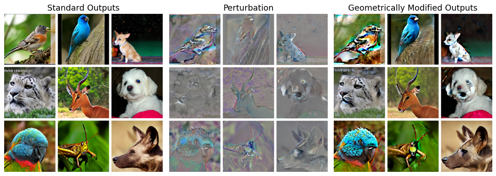

# Improving Generative Model Self-training with Geometrically Modified Outputs

AUTHORS (AFFILIATION)

VENUE. [[paper]](paper/Improving_Generative_Model_Self-training_with_Geometrically_Modified_Outputs.pdf)

## Summary

Self-training methods such as Neon use a model's standard outputs as a negative signal. Geometrically Modified Outputs (GMOs) reweight the singular values of the generator's Jacobian, amplifying the leading singular direction, which gives a stronger negative signal. Using GMOs in place of standard outputs in Neon lowers FID across one-step generators on ImageNet 256.

<p align="center">
  
</p>
<p align="center"><em>Standard outputs, the GMO perturbation, and the resulting GMOs for IMM on ImageNet 256.</em></p>

Experiments cover IMM, MeanFlow, and AlphaFlow.

## Contents

- `gmo/` the GMO correction, shared by all models
- `imm/` GMO generation, finetuning, Neon merge, and FID for IMM
- `meanflow/` GMO generation and FID for MeanFlow
- `alphaflow/` GMO generation, finetuning, and FID (with Neon merge) for AlphaFlow
- `checkpoints/`, `fid_stats/` download scripts for checkpoints and ImageNet 256 reference statistics
- `generate_gmo_grid.py` sample grids of standard outputs and GMOs

## Setup

```bash
pip install -r requirements.txt
python checkpoints/download.py --all
python fid_stats/download.py --key adm_in256_stats
```

`checkpoints/download.py` fetches our checkpoints after Neon self-training with GMOs. Base checkpoints come from [IMM](https://github.com/lumaai/imm) (`imagenet256_ts_a2.pkl`), [MeanFlow](https://github.com/zhuyu-cs/MeanFlow), and [AlphaFlow](https://github.com/snap-research/alphaflow); place them in `checkpoints/`.

Finetuning uses the training code from [Neon](https://github.com/VITA-Group/Neon) (IMM) and [AlphaFlow](https://github.com/snap-research/alphaflow); `imm/finetune.sh` clones Neon into `third_party/`, and `alphaflow/finetune.py` expects AlphaFlow at `third_party/alphaflow`.

## Running

```bash
python imm/generate_gmo.py --checkpoint checkpoints/imagenet256_ts_a2.pkl --output-dir spectral_data_imm --alphas 0.1,0.3,0.5
python imm/lmdb_to_png.py spectral_data_imm/combined_alpha_0.5 data/imm_alpha_0.5
bash imm/finetune.sh data/imm_alpha_0.5 runs/imm_alpha_0.5
python imm/merge.py --base checkpoints/imagenet256_ts_a2.pkl --aux runs/imm_alpha_0.5/<run>/network-snapshot-000060.pkl --w 0.8 --out merged.pkl
torchrun --nproc_per_node=8 imm/eval.py --checkpoint-path merged.pkl --cfg-scale 1.3

python meanflow/generate_gmo.py --checkpoint checkpoints/meanflow_sit_b_2.pt --model SiT-B/2 --output-dir spectral_data_meanflow
torchrun --nproc_per_node=8 meanflow/eval.py --checkpoint-key sit_b_2 --download-missing

python alphaflow/generate_gmo.py --base-ckpt checkpoints/alphaflow_b_2_base.pt --output-dir spectral_data_alphaflow
python alphaflow/lmdb_to_folder.py spectral_data_alphaflow/combined_alpha_0.1 data/af_alpha0.1
python alphaflow/finetune.py --data data/af_alpha0.1 --base checkpoints/alphaflow_b_2_base.pt --out theta_s.pt
torchrun --nproc_per_node=8 alphaflow/eval.py --checkpoint-path checkpoints/alphaflow_b_2_base.pt --aux-ckpt theta_s.pt --w 0.1

torchrun --nproc_per_node=8 imm/eval.py --checkpoint-key imm --download-missing

python generate_gmo_grid.py --checkpoint-key imm --download-missing --alpha 0.5
```

Code builds on [IMM](https://github.com/lumaai/imm), [MeanFlow](https://github.com/zhuyu-cs/MeanFlow), [AlphaFlow](https://github.com/snap-research/alphaflow), and [Neon](https://github.com/VITA-Group/Neon).

## Citation

```bibtex
@inproceedings{KEY,
  title     = {Improving Generative Model Self-training with Geometrically Modified Outputs},
  author    = {AUTHORS},
  booktitle = {VENUE},
  year      = {YEAR}
}
```
